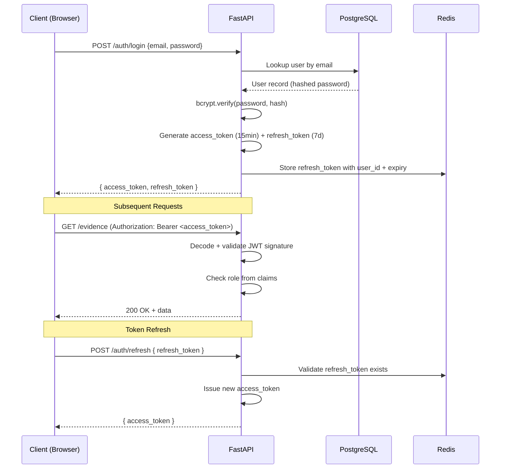
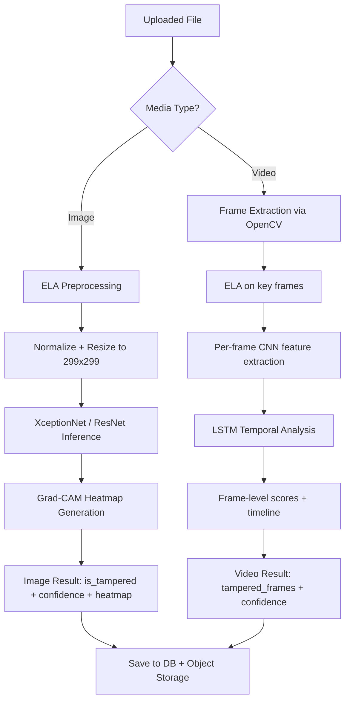
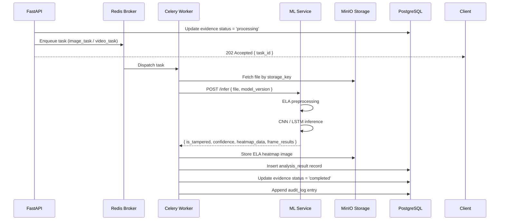

# Technical Project Plan
## Machine Learning Detection of Digital Evidence Tampering in Images and Videos
**MSc Cyber Security — CMM500 Project | Student: Aswathy Ajayan**

---

> [!IMPORTANT]
> This is a planning document only. No code is written yet. Review and approve this plan before execution begins.

---

## Overview

This plan describes a forensic-grade full-stack web application that detects tampering in digital images and videos. It uses a hybrid ML pipeline (ELA + CNN + LSTM), maintains a forensic audit trail, and is built as a modular, Dockerized system suitable for academic evaluation and real-world forensic principles.

**Core Technology Stack:**

| Layer | Technology |
|---|---|
| Frontend | Next.js 14 (App Router) + Tailwind CSS |
| Backend API | FastAPI (Python 3.11) |
| ML Service | PyTorch 2.x + TorchServe |
| Database | PostgreSQL 15 |
| Cache / Queue Broker | Redis 7 |
| Background Worker | Celery 5 |
| File Storage | MinIO (S3-compatible, self-hosted) |
| Containerization | Docker + Docker Compose |
| Auth | JWT (access + refresh tokens) |

---

## 1. Project Folder Structure

```
cs-forensics-system/
│
├── docker-compose.yml
├── .env.example
├── README.md
│
├── frontend/                          # Next.js application
│   ├── app/
│   │   ├── (auth)/login/
│   │   ├── (auth)/register/
│   │   ├── dashboard/
│   │   ├── evidence/[id]/             # Evidence detail + result view
│   │   └── admin/                     # Admin panel (RBAC)
│   ├── components/
│   │   ├── ui/                        # Reusable UI primitives
│   │   ├── forensics/
│   │   │   ├── ElaHeatmap.tsx
│   │   │   ├── FrameTimeline.tsx
│   │   │   └── ConfidenceGauge.tsx
│   │   └── layout/
│   ├── lib/
│   │   ├── api.ts                     # Typed API client
│   │   └── auth.ts                    # JWT token management
│   └── Dockerfile
│
├── backend/                           # FastAPI application
│   ├── app/
│   │   ├── main.py
│   │   ├── core/
│   │   │   ├── config.py              # Settings via pydantic-settings
│   │   │   ├── security.py            # JWT, password hashing
│   │   │   └── logging.py             # Structured audit logger
│   │   ├── api/
│   │   │   └── v1/
│   │   │       ├── auth.py
│   │   │       ├── evidence.py
│   │   │       ├── analysis.py
│   │   │       └── admin.py
│   │   ├── models/                    # SQLAlchemy ORM models
│   │   │   ├── user.py
│   │   │   ├── evidence.py
│   │   │   ├── analysis.py
│   │   │   └── audit_log.py
│   │   ├── schemas/                   # Pydantic request/response schemas
│   │   ├── services/
│   │   │   ├── file_service.py        # Upload, hash, storage
│   │   │   ├── analysis_service.py    # Dispatch to ML task
│   │   │   └── audit_service.py
│   │   ├── tasks/                     # Celery task definitions
│   │   │   ├── image_task.py
│   │   │   └── video_task.py
│   │   └── db/
│   │       ├── session.py
│   │       └── migrations/            # Alembic migrations
│   ├── tests/
│   └── Dockerfile
│
├── ml-service/                        # Standalone ML inference layer
│   ├── models/
│   │   ├── image/
│   │   │   ├── xception_handler.py
│   │   │   └── resnet_handler.py
│   │   └── video/
│   │       └── cnn_lstm_handler.py
│   ├── preprocessing/
│   │   ├── ela.py                     # Error Level Analysis
│   │   ├── frame_extractor.py         # OpenCV video → frames
│   │   └── normalizer.py
│   ├── registry/
│   │   └── model_registry.py          # Load by version from manifest
│   ├── model_store/                   # Versioned .pt / .mar files
│   │   ├── manifest.json              # Model version metadata
│   │   └── v1/
│   │       ├── xception_forensic.pt
│   │       └── cnn_lstm_video.pt
│   ├── server.py                      # FastAPI micro-service for inference
│   └── Dockerfile
│
└── infra/
    ├── nginx/
    │   └── nginx.conf                 # Reverse proxy config
    └── postgres/
        └── init.sql                   # Initial schema seed
```

---

## 2. Database Schema Design

### Entity Relationship Summary

```
Users ──< Evidence ──< AnalysisResults
  │                         │
  └──< AuditLogs ───────────┘
              │
          ModelVersions
```

### Table Definitions

#### `users`
```sql
id            UUID PRIMARY KEY DEFAULT gen_random_uuid()
email         VARCHAR(255) UNIQUE NOT NULL
password_hash VARCHAR(255) NOT NULL
role          ENUM('analyst', 'admin', 'viewer') NOT NULL DEFAULT 'analyst'
is_active     BOOLEAN DEFAULT TRUE
created_at    TIMESTAMPTZ DEFAULT NOW()
last_login    TIMESTAMPTZ
```

#### `evidence`
```sql
id             UUID PRIMARY KEY DEFAULT gen_random_uuid()
uploaded_by    UUID REFERENCES users(id)
filename       VARCHAR(255) NOT NULL          -- original filename
storage_key    VARCHAR(512) NOT NULL          -- UUID-based storage path
file_size      BIGINT NOT NULL
mime_type      VARCHAR(100) NOT NULL
sha256_hash    CHAR(64) NOT NULL              -- forensic integrity
media_type     ENUM('image', 'video') NOT NULL
status         ENUM('pending', 'processing', 'completed', 'failed')
uploaded_at    TIMESTAMPTZ DEFAULT NOW()
ip_address     INET NOT NULL
```

#### `analysis_results`
```sql
id                UUID PRIMARY KEY DEFAULT gen_random_uuid()
evidence_id       UUID REFERENCES evidence(id)
model_version_id  UUID REFERENCES model_versions(id)
task_id           VARCHAR(255)                -- Celery task ID
is_tampered       BOOLEAN
confidence_score  FLOAT
processing_time_s FLOAT
ela_heatmap_key   VARCHAR(512)               -- Storage path for ELA output
frame_results     JSONB                       -- Per-frame scores for video
metadata          JSONB                       -- Extra forensic notes
created_at        TIMESTAMPTZ DEFAULT NOW()
```

#### `model_versions`
```sql
id             UUID PRIMARY KEY DEFAULT gen_random_uuid()
model_name     VARCHAR(100) NOT NULL          -- e.g. 'xception_forensic'
version_tag    VARCHAR(50) NOT NULL           -- e.g. 'v1.2.0'
architecture   VARCHAR(100) NOT NULL          -- e.g. 'XceptionNet'
dataset_trained VARCHAR(200)                  -- e.g. 'FaceForensics++'
accuracy       FLOAT
f1_score       FLOAT
is_active      BOOLEAN DEFAULT TRUE
registered_at  TIMESTAMPTZ DEFAULT NOW()
```

#### `audit_logs`
```sql
id          UUID PRIMARY KEY DEFAULT gen_random_uuid()
user_id     UUID REFERENCES users(id)
event_type  ENUM('login', 'logout', 'upload', 'analysis_start',
                 'analysis_complete', 'download', 'admin_action')
resource_id UUID                               -- FK to evidence/result
ip_address  INET
user_agent  TEXT
details     JSONB
occurred_at TIMESTAMPTZ DEFAULT NOW()
```

> [!NOTE]
> All tables use UUID primary keys (never sequential integers) and timestamptz for all timestamps. The `audit_logs` table is append-only — no UPDATE or DELETE permissions are granted to the application user.

---

## 3. API Endpoint Design

### Base URL: `/api/v1`

#### Authentication (`/auth`)
| Method | Endpoint | Description | Auth Required |
|---|---|---|---|
| POST | `/auth/register` | Register new analyst account | No |
| POST | `/auth/login` | Returns access + refresh tokens | No |
| POST | `/auth/refresh` | Exchange refresh token | Yes (refresh) |
| POST | `/auth/logout` | Revoke refresh token | Yes |

#### Evidence (`/evidence`)
| Method | Endpoint | Description | Role |
|---|---|---|---|
| POST | `/evidence/upload` | Upload image or video file | analyst+ |
| GET | `/evidence` | List own evidence (paginated) | analyst+ |
| GET | `/evidence/{id}` | Get evidence metadata + status | analyst+ |
| DELETE | `/evidence/{id}` | Soft-delete evidence record | admin |

#### Analysis (`/analysis`)
| Method | Endpoint | Description | Role |
|---|---|---|---|
| POST | `/analysis/{evidence_id}` | Trigger analysis on evidence | analyst+ |
| GET | `/analysis/{result_id}` | Get full analysis result | analyst+ |
| GET | `/analysis/{result_id}/heatmap` | Serve ELA heatmap image | analyst+ |
| GET | `/analysis/{result_id}/frames` | Get per-frame scores (video) | analyst+ |

#### Admin (`/admin`)
| Method | Endpoint | Description | Role |
|---|---|---|---|
| GET | `/admin/users` | List all users | admin |
| PATCH | `/admin/users/{id}` | Update role / deactivate | admin |
| GET | `/admin/audit-logs` | Query audit logs | admin |
| GET | `/admin/models` | List registered model versions | admin |
| POST | `/admin/models` | Register new model version | admin |

---

## 4. Authentication Flow



**Key decisions:**
- Access token: **15-minute expiry**, RS256 signed (asymmetric key pair)
- Refresh token: **7-day expiry**, stored in Redis (revocable)
- Refresh token rotation: issuing a new one on each refresh (old revoked)
- RBAC enforced via `Depends()` decorators in FastAPI

---

## 5. ML Pipeline Structure



### ELA Preprocessing (Detail)
1. Re-save image at a fixed JPEG quality (e.g., 95%)
2. Compute pixel-wise absolute difference: `ELA = |original - resaved|`
3. Amplify difference by scale factor for visibility
4. Output: high-contrast heatmap highlighting re-compressed regions

### Model Selection Rationale
| Model | Purpose | Dataset | Trade-off |
|---|---|---|---|
| XceptionNet | Image forgery classification | FaceForensics++ | High accuracy, GPU-heavy |
| ResNet-50 | Lighter image classification | CASIA v2 | Faster, slightly lower accuracy |
| CNN + LSTM | Video temporal analysis | FaceForensics++ video | Complex, captures motion artifacts |

---

## 6. Background Task Flow (Celery)



**Task queues:**
- `image_queue` — lightweight, fast workers (CPU-only acceptable)
- `video_queue` — GPU workers, higher timeout (up to 10 min for long videos)
- `priority_queue` — admin-triggered re-analysis

---

## 7. Security Checklist

### File Upload Security
- [x] Whitelist allowed MIME types: `image/jpeg`, `image/png`, `video/mp4`, `video/avi`
- [x] Validate file extension against MIME type (prevent extension spoofing)
- [x] Enforce maximum file sizes (images: 50MB, videos: 2GB)
- [x] Rename all files to UUID on server — never use original filename for storage
- [x] Store files in MinIO bucket with no public access
- [x] Compute SHA-256 hash before storage; store in DB

### Authentication & Authorization
- [x] bcrypt password hashing with cost factor ≥ 12
- [x] RS256 JWT (asymmetric) — private key never exposed to clients
- [x] Short-lived access tokens (15 min)
- [x] Refresh token rotation on each use
- [x] RBAC enforced at the FastAPI dependency level
- [x] Rate limiting on `/auth/login` (max 5 attempts / 10 min per IP)

### API Security
- [x] All endpoints require authentication except `/auth/login` and `/auth/register`
- [x] Input validation via Pydantic schemas (reject unexpected fields)
- [x] Path traversal prevention: storage keys are UUID-only, never derived from user input
- [x] CORS restricted to known frontend origins
- [x] Helmet-equivalent security headers via middleware
- [x] SQL injection prevention: use ORM only, no raw queries

### ML Service Security
- [x] ML service is NOT exposed publicly — internal Docker network only
- [x] Backend calls ML service via internal service name, not public URL
- [x] No model weights downloadable via API
- [x] Inference results are NOT cacheable client-side (no-store headers)

### Audit & Forensic Integrity
- [x] Append-only audit log table (DB user has no DELETE/UPDATE on this table)
- [x] Every analysis result linked to specific model version (reproducibility)
- [x] SHA-256 hash checked on every retrieval (tamper detection of stored files)
- [x] All log entries include timestamp (microsecond precision), IP, user agent

---

## 8. Deployment Strategy

### Docker Compose Services

```yaml
services:
  frontend:        # Next.js — port 3000 (internal)
  backend:         # FastAPI — port 8000 (internal)
  ml-service:      # PyTorch inference API — port 8001 (internal only)
  celery-worker:   # Celery worker (image queue)
  celery-gpu:      # Celery worker (video queue, GPU-enabled)
  redis:           # Broker + result backend
  postgres:        # Primary DB
  minio:           # Object storage
  nginx:           # Reverse proxy — port 443 (public)
```

### Nginx Routing
```
/ → frontend:3000
/api/ → backend:8000
/minio/ → minio:9000 (admin only, private)
```

> [!WARNING]
> The `ml-service` container must **never** be exposed via Nginx. It is internal-only.

### Environment Configuration
All secrets via `.env` files (never committed to git):
- `DATABASE_URL`, `REDIS_URL`, `MINIO_ACCESS_KEY`, `MINIO_SECRET_KEY`
- `JWT_PRIVATE_KEY`, `JWT_PUBLIC_KEY`
- `ML_SERVICE_URL` (internal Docker service URL)

### Cloud Deployment (Future Phase)
| Component | AWS Equivalent | GCP Equivalent |
|---|---|---|
| Docker containers | ECS Fargate | Cloud Run |
| PostgreSQL | RDS (Postgres) | Cloud SQL |
| Redis | ElastiCache | Memorystore |
| Object Storage | S3 | GCS |
| GPU Worker | EC2 G4dn | GCE T4 |

---

## 9. Model Versioning Strategy

### Manifest File (`model_store/manifest.json`)
```json
{
  "active_image_model": "xception_v1.2.0",
  "active_video_model": "cnn_lstm_v1.0.0",
  "versions": {
    "xception_v1.2.0": {
      "file": "v1/xception_forensic.pt",
      "architecture": "XceptionNet",
      "trained_on": "FaceForensics++",
      "f1_score": 0.962,
      "registered_at": "2026-02-01T00:00:00Z"
    },
    "cnn_lstm_v1.0.0": {
      "file": "v1/cnn_lstm_video.pt",
      "architecture": "CNN+LSTM",
      "trained_on": "FaceForensics++ video",
      "f1_score": 0.941,
      "registered_at": "2026-02-01T00:00:00Z"
    }
  }
}
```

### Versioning Rules
1. Model files are **immutable** once registered — new training creates a new version
2. Every analysis result stores `model_version_id` → results remain reproducible
3. Admin can mark old versions inactive, but results retain the version reference
4. Model files are stored in MinIO under `model-store/<version>/` with SHA-256 checksums

---

## Development Phases

| Phase | Milestone | Estimated Duration |
|---|---|---|
| **Phase 1** | Planning & approval (this document) | Week 1 |
| **Phase 2** | Project scaffolding + DB + Auth | Week 2–3 |
| **Phase 3** | File upload + ELA preprocessing | Week 4 |
| **Phase 4** | CNN image inference pipeline | Week 5–6 |
| **Phase 5** | LSTM video pipeline | Week 7–8 |
| **Phase 6** | Frontend dashboard + visualizations | Week 9–10 |
| **Phase 7** | Security hardening + audit logging | Week 11 |
| **Phase 8** | Evaluation (F1, precision, recall) + report | Week 12 |

---

## Risks & Mitigations

| Risk | Likelihood | Impact | Mitigation |
|---|---|---|---|
| GPU unavailable for LSTM training | Medium | High | Use Google Colab + export `.pt`; serve on CPU with slower inference |
| FaceForensics++ dataset licensing | Low | Medium | Plan for CASIA v2 as fallback; both are free for academic use |
| LSTM overfitting on small video set | High | High | Apply dropout, early stopping; augment with frame shuffling |
| ELA ineffective post-social-media compression | Medium | Medium | Apply deblocking pre-processing; document as known limitation |
| Celery worker crashes mid-video | Low | Medium | Implement Celery task retry with exponential backoff |
| JWT private key exposure via misconfigured env | Low | Critical | Audit `.gitignore`, use secrets manager in production |

---

## Next Steps

1. Review and approve this technical plan
2. Confirm: **Next.js** for frontend (vs plain React)?
3. Confirm: **MinIO** for local storage (vs cloud S3 from day one)?
4. Confirm: GPU availability for video model training?
5. Begin Phase 2: scaffolding + Docker Compose base setup
